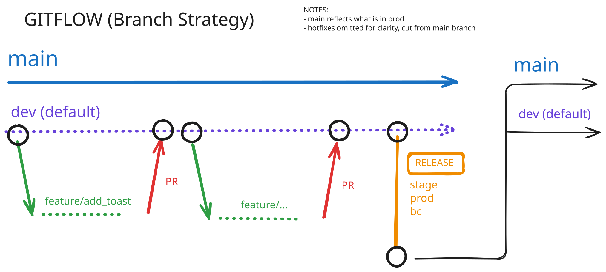

# gitflow-iac-sandbox

Practice repo: Gitflow branching, CI/CD via GitHub Actions, CloudFormation → Terraform.

## Branching



`main` and `develop` are protected — work happens on `feature/<TICKET>-<description>`, branched from `develop`, PR'd back in.

```bash
git checkout -b feature/LEARN-XXX-description develop
git push -u origin feature/LEARN-XXX-description
gh pr create --base develop --title "LEARN-XXX -- Description"
```

`setup/gitflow.sh` bootstraps this on a fresh clone — creates `develop`, applies branch protection.

## CI/CD
*in progress — LEARN-102*

## CloudFormation → Terraform
*not started*

---

**Setup**

```bash
brew install gh awscli
chmod +x setup/gitflow.sh && ./setup/gitflow.sh
```

AWS account: `john-dev`

**Progress**

| Ticket | Description | Status |
|---|---|---|
| LEARN-101 | Repo structure, gitflow script, branch protection | done |
| LEARN-102 | GitHub Actions CI workflow | in progress |